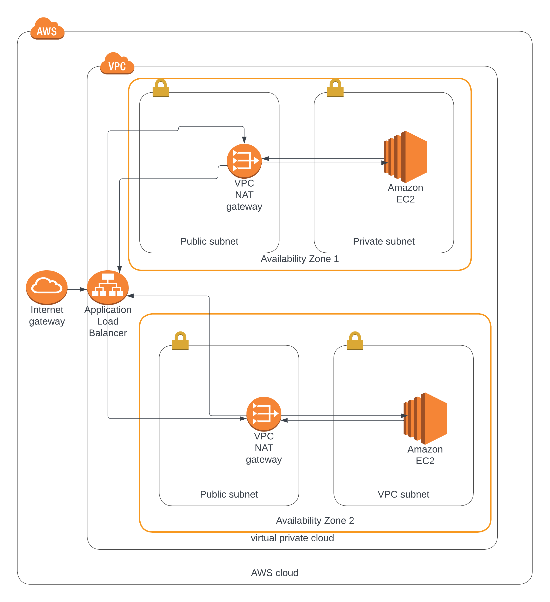
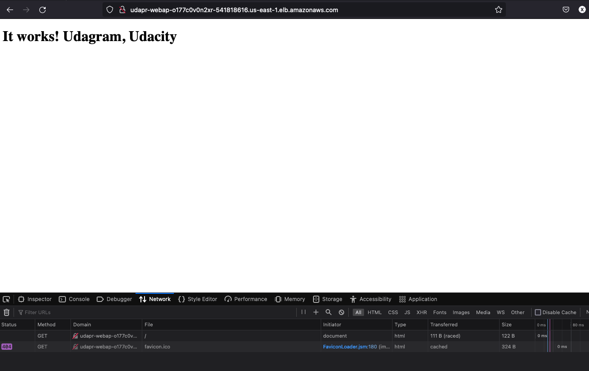

# Udagram, Udacity DevOps Project 2
This CloudFormation template deploys a Virtual Private Cloud (VPC) with public and private subnets in two availability zones. It also deploys an Internet Gateway and a NAT Gateway for each public subnet. The NAT Gateways are used to allow the private subnets to access the internet. Two public subnets and two private subnets are created in two availability zones. Two Elastic IP addresses (EIPs) are created for the NAT Gateways.

In addition, this template also creates an Amazon Machine Image (AMI) for an EC2 instance with the general purpose instance type specified by the user. This instance will be launched with an AWS Identity and Access Management (IAM) role that allows read-only access to a specific Amazon Simple Storage Service (S3) bucket. The template also creates an Auto Scaling Group (ASG) with the created AMI that will be launched in the private subnets, and a load balancer with a listener and listener rule that will route incoming traffic to the instances in the ASG.

## Table of Contents
- [Table of Contents](#table-of-contents)
- [Server Specs](#server-specs)
- [Installation](#installation)
- [Parameters](#parameters)
- [Resources](#resources)
- [Usage](#usage)
- [Diagram](#diagram)
- [Contributing](#contributing)
- [License](#license)
- [Contact](#contact)

## Installation
Install 'aws cli' for windows
```powershell
msiexec.exe /i https://awscli.amazonaws.com/AWSCLIV2.msi
```

## Parameters

- EnvironmentName: An environment name that will be prefixed to resource names.
- VpcCIDR: The IP range (CIDR notation) for the VPC. Default: 10.0.0.0/16.
- PublicSubnet1CIDR: The IP range (CIDR notation) for the public subnet in the first availability zone. Default: 10.0.0.0/24.
- PublicSubnet2CIDR: The IP range (CIDR notation) for the public subnet in the second availability zone. Default: 10.0.1.0/24.
- PrivateSubnet1CIDR: The IP range (CIDR notation) for the private subnet in the first availability zone. Default: 10.0.2.0/24.
- PrivateSubnet2CIDR: The IP range (CIDR notation) for the private subnet in the second availability zone. Default: 10.0.3.0/24.
- InstanceType: The EC2 instance type of general purpose. Allowed values: t2.medium, t3.medium.
- AMI: The ID of the AMI to use for the base image.

## Resources

- VPC: An AWS::EC2::VPC resource that creates the VPC.
- InternetGateway: An AWS::EC2::InternetGateway resource that creates the internet gateway.
- InternetGatewayAttachment: An AWS::EC2::VPCGatewayAttachment resource that attaches the internet gateway to the VPC.
- PublicSubnet1: An AWS::EC2::Subnet resource that creates the public subnet in the first availability zone.
- PublicSubnet2: An AWS::EC2::Subnet resource that creates the public subnet in the second availability zone.
- PrivateSubnet1: An AWS::EC2::Subnet resource that creates the private subnet in the first availability zone.
- PrivateSubnet2: An AWS::EC2::Subnet resource that creates the private subnet in the second availability zone.
- NatGateway1EIP: An AWS::EC2::EIP resource that creates an Elastic IP for the NAT Gateway in the first availability zone.
- NatGateway2EIP: An AWS::EC2::EIP resource that creates an Elastic IP for the NAT Gateway in the second availability zone.
- NatGateway1: An AWS::EC2::NatGateway resource that creates the NAT Gateway in the first availability zone.
- NatGateway2: An AWS::EC2::NatGateway resource that creates the NAT Gateway in the second availability zone.

## Server Specs
- us-east-1
- 2 vCPUs 
- 4GB of RAM. 
- Ubuntu 18, choose an Instance size and Machine Image (AMI)
- at least 10GB of disk space 
- 2 Elastic (public) IP addresses
- 2 Availability Zones
- 2 Pubilc Subnets
- 2 Private Subnets
- 2 NAT Gateways
- 2 EC2 Instances, each inside a different 'Availability Zone' inside the 'Private Subnet'
- 1 Load Balancer
- 1 'Target Group'
- 1 'Auto Scaling Group'
- 1 'Launch Configuration'
- 1 'Internet Gateway'

## Usage

Run this command to start the application

### Create the stack using the AWS CLI in Powershell
```powershell
aws cloudformation create-stack `
--stack-name "udaProject2" `
--template-body file://C:\p2network.yml `
--parameters file://C:\p2param.json `
--region us-east-1 `
--capabilities CAPABILITY_NAMED_IAM

```


### Update the stack using the AWS CLI in Powershell
```powershell
aws cloudformation update-stack `
--stack-name "udaProject2" `
--template-body file://C:\p2network.yml `
--parameters file://C:\p2param.json `
--region us-east-1 `
--capabilities CAPABILITY_NAMED_IAM
```


### Delete the stack using the AWS CLI in Powershell
```powershell
aws cloudformation delete-stack `
--stack-name "udaProject2" `
--region us-east-1
```


### Create the stack using the AWS CLI in Bash
```bash
aws cloudformation create-stack \
--stack-name "udaProject2" \
--template-body file://C:\p2network.yml \
--parameters file://C:\p2param.json \
--region us-east-1 \
--capabilities CAPABILITY_NAMED_IAM
```


### Update the stack using the AWS CLI in Bash
```bash
aws cloudformation update-stack \
--stack-name "udaProject2" \
--template-body file://C:\p2network.yml \
--parameters file://C:\p2param.json \
--region us-east-1 \
--capabilities CAPABILITY_NAMED_IAM
```


### Delete the stack using the AWS CLI in Bash
```bash
aws cloudformation delete-stack \
--stack-name "udaProject2" \
--region us-east-1
```


## Diagram



## Results
http://udapr-webap-o177c0v0n2xr-541818616.us-east-1.elb.amazonaws.com/



## Contributing

Udacity Student

## License

This project is licensed under the [License Name] License - see the [LICENSE](LICENSE) file for details

## Contact

- Terry S
- Email: [Your Email]